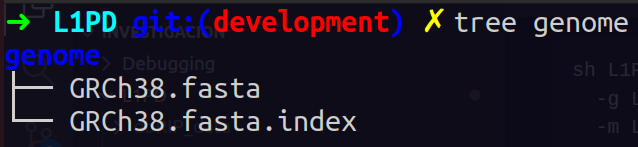
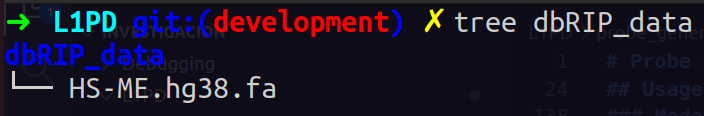
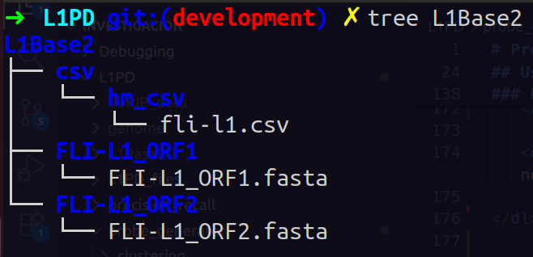

# Probe generator

## Overview:

Probe generator is the process used to generate the sequence probes. These are generated by a denoted K length established by the user. It supports both LINE-1 elements (with ORF1 and ORF2 components) and Alu elements (SINEs) as inputs. The pipeline performs sequence alignment, k-mer extraction, genome mapping, and probe filtering.

## Requirements:

- Python 3

  - Matplotlib
  - Numpy
  - Levenshtein
  - Scipy

- [mrFAST](https://github.com/BilkentCompGen/mrfast/)
- [Samtools](https://www.htslib.org/) 1.11 or newer
- [BWA](http://bio-bwa.sourceforge.net/)

## Modes:

Users can specify what mode they wish to use by calling the respective scripts

## Usage:

Probe generation can be launched in one of two ways, by running the probe_generator.sh script depending on the retro-transposon you wish to generate probes for.
To avoid path issues always provide the absolute path for parameters.

### LINE1 Mode:

- Other [options](#mode-options)

  - -a --aligner
  - -h --help
  - -j --join_kmers
  - -p --merge_pct
  - -S --skip_aln
  - -v --verbose

- The tool automatically generates aligned sequences unless `-S | --skip_aln` is specified. Provide an output filename with `-A | --aligned` to save the align file and use `-S | --skip_aln` with `-A | --aligned` to bypass alignment and use that aligned file.

- Example command:

```sh
./L1PD/probe_generator/probe_generator.sh
    -g <GENOME-FILE>
    -m <METADATA>
    -i <INPUT-FILE>
    -o <OUTPUT-FILE>
    -k <KMER-SIZE>
    -r <IDENTITY-PERCENTAGE>
    -A <ALIGNED-FILE>
    -c <ORF>
    -q Line1
```

###### Examples:

- Generating probes for ORF1:

```sh
sh L1PD/probe_generator/probe_generator.sh \
  -g L1PD/genome/GRCh38.fasta \
  -m L1PD/L1Base2/csv/hum_csv/fli-l1.csv \
  -i L1PD/L1Base2/FLI-L1_ORF1/FLI-L1_ORF1.fasta \
  -o "50mers_ORF1_probes.fasta" \
  -k 50 \
  -r 95 \
  -A "50mers_aligned_ORF1.fa" \
  -c "ORF1" \
  -q "Line1"
```

- Generating probes for ORF2:

```sh
sh L1PD/probe_generator/probe_generator.sh \
  -g L1PD/genome/GRCh38.fasta \
  -m L1PD/L1Base2/csv/hum_csv/fli-l1.csv \
  -i L1PD/L1Base2/FLI-L1_ORF2/FLI-L1_ORF2.fasta \
  -o "50mers_ORF2_probes.fasta" \
  -k 50 \
  -r 95 \
  -A "50mers_aligned_ORF2.fa" \
  -c "ORF2" \
  -q "Line1"
```

### Alu Mode:

- Parsed Alu sequences not provided (input file should be `HS-ME.hg38.fa`)

```sh
sh L1PD/probe_generator/probe_generator.sh
    -g <GENOME-FILE>
    -m <METADATA>
    -i <INPUT-FILE>
    -o <OUTPUT-FILE>
    -k <KMER-SIZE>
    -r <IDENTITY-PERCENTAGE>
    -A <ALIGNED-FILE-NAME>
    -c Alu
    -q Alu
```

- Parsed Alu sequences provided (skip parsing)

```sh
sh L1PD/probe_generator/probe_generator.sh
    -g <GENOME-FILE>
    -m <METADATA>
    -i <INPUT-FILE>
    -o <OUTPUT-FILE>
    -k <KMER-SIZE>
    -r <IDENTITY-PERCENTAGE>
    -A <ALIGNED-FILE-NAME>
    -c Alu
    -q Alu
    -s
```

###### Examples:

- In this case "alu_sequences.fasta" must contain the parsed alu sequences

```sh
sh L1PD/probe_generator/probe_generator.sh \
  -g L1PD/genome/GRCh38.fasta \
  -m "alu-metadata.csv" \
  -i "alu_sequences.fasta" \
  -o "alu_50mer_probes.fasta" \
  -k 50 \
  -r 95 \
  -A "alu_sequences_aligned.fasta" \
  -c "Alu" \
  -q "Alu" \
  -s
```

### Mode options

<dl>
   <dt>-A --aligned</dt><dd>Named of the file containing the aligned sequences</dd>
   
   <dt>-a --aligner</dt><dd>Aligner software to be used.  Options are: clustalo, muscle,    mafft, tcoffee. NOTE: The program must be installed and available in your system.
   [Default: clustalo]</dd>

   <dt>-c --component</dt><dd>LINE1 component for which probes are being generated (ORF1 or ORF2). Will be used as prefix for k-mer names and as probe filtering criterion. [Default: ORF1]</dd>

   <dt>-g --genome</dt><dd>Reference genome in FASTA format, used for mapping the k-mers</dd>
   
   <dt>-h --help</dt><dd>Help (shows usage).</dd>

   <dt>-i --input</dt><dd> Input file with original sequences </dd>

   <dt>-j --join_kmers</dt><dd> Final k-mer size to attain after joining k-mers. Consecutive k-mers will be joined when the percentage of mismatches between them does not exceed --merge_pct argument.</dd>

   <dt>-k --kmersize</dt><dd>Size of k-mer sequence to extract</dd>
   
   <dt>-m --metadata</dt><dd>Metadata in CSV format of full-length intact L1s (FLI-L1)</dd>

   <dt>-o --output</dt><dd>Name of output file containing probes</dd>

   <dt>-p --merge_pct</dt><dd> Percentage of mismatches allowed between two k-mers in order to merge them into a larger k-mer. </dd>

   <dt>-q --sequence </dt><dd>Sequence type, currently supporting Line1 and Alu [Default: Line1] </dd>

   <dt>-r --identity</dt><dd>Percentage range of identity</dd>

   <dt>-S --skip_aln</dt><dd>Skip alignment; to be used when input file is already aligned. </dd>

   <dt>-s --skip_par</dt><dd>Skip parsing of Alu sequences (provide input sequences and metadata instead)</d>

   <dt>-t --threads</dt><dd>Amount of </dd>

   <dt>-v --verbose</dt><dd>Adds verbosity and outputs all result details. [Default: non-verbose; outputs just the probes] </dd>

</dl>

### Input Data:

- Unfortunately input files cannot be uploaded to the repository since they are large. Nevertheless, this section was added to guide users through the process of downloading and organizing the input data. Future efforts might include an automation script for downloading and organizing the input files.
- Input data for Line1 mode can be found at [L1Base2](https://l1base.charite.de/l1base.php)
- Input data for Alu mode can be downloaded from the following link [dbRIP](https://dbrip.brocku.ca/dbRIPdownload/HS-ME/HS-ME.hg38.fa)
- For simplicity input data was organize inside L1PD with the following structure:
- 
- 
- 
- By downloading the input data and organizing it with this structure users should be able to run the Mode commands and generate probes accordingly.
